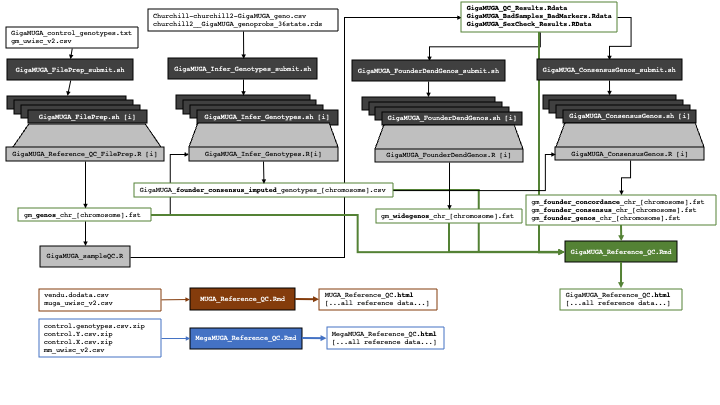

# GeDI MUGA Reference Data Repository

## About

The [JAX Genetic Diversity Initiative (GeDI)](https://www.jax.org/research-and-faculty/genetic-diversity-initiative) is a collection of researchers, tools, resources, and data sources all directed towards discovering the genetic basis of complex traits using diverse mouse populations. The Mouse Universal Genotyping Array (MUGA) series of genotyping arrays powers many experiments supported in the past and present by GeDI. Reference genotypes and probe intensities for a collection of important mouse strains are available here for the MUGA, MegaMUGA, and GigaMUGA platforms updated to the mouse genome build GRCm39. In addition, we have made consensus genotypes and mean probe intensities available for the eight founders of the Collaborative Cross strains and the Diversity Outbred mouse population on each genotyping platform.

## Downloading Genotype Data

Reference genotype data can be downloaded by navigating to the [workflowr webpage](https://sam-widmayer.github.io/MUGA_reference_data/index.html), and clicking the link corresponding to any data source. Quality control analyses are also documented at the top of the page for each array.

## Contents

This repository is supported by [workflowr](https://workflowr.github.io/workflowr/). The repository webpage is built from the underlying analyses which are compiled from the files in the **analysis** subdirectory into the **docs/** subdirectory. The [MUGA](https://github.com/sam-widmayer/MUGA_reference_data/blob/main/analysis/MUGA_Reference_QC.Rmd) and [MegaMUGA](https://github.com/sam-widmayer/MUGA_reference_data/blob/main/analysis/MegaMUGA_Reference_QC.Rmd) RMarkdown files can be reproduced locally using RStudio with dependencies installed.

The [GigaMUGA](https://github.com/sam-widmayer/MUGA_reference_data/blob/main/analysis/GigaMUGA_Reference_QC.Rmd) RMarkdown file can be run locally but uses intermediary data sources from analyses that rely on the HPC infrastructure at JAX. These intermediary .RData files are available in the **data** subdirectory. An flowchart of this analysis, and the expected inputs and outputs of other RMarkdown files, can be found below.

